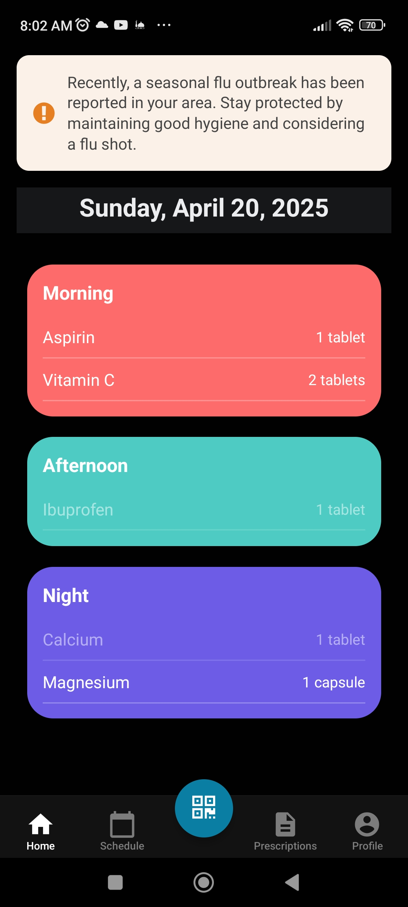
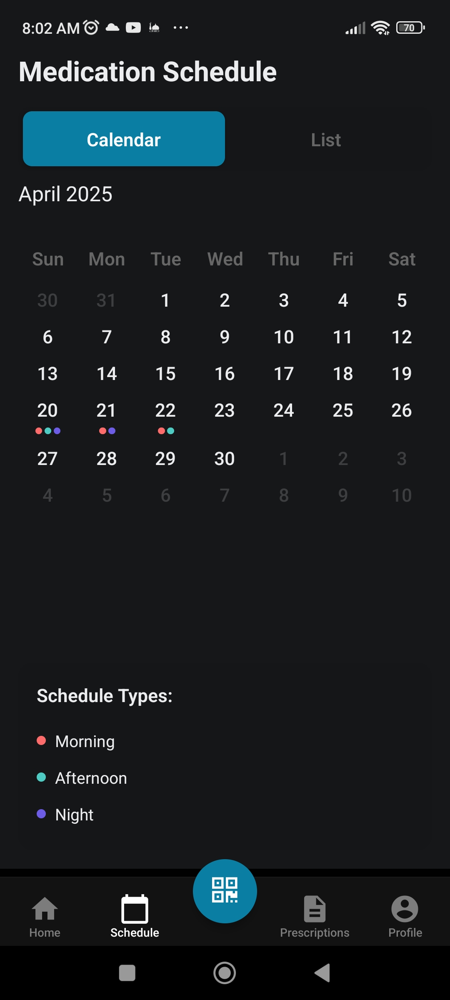
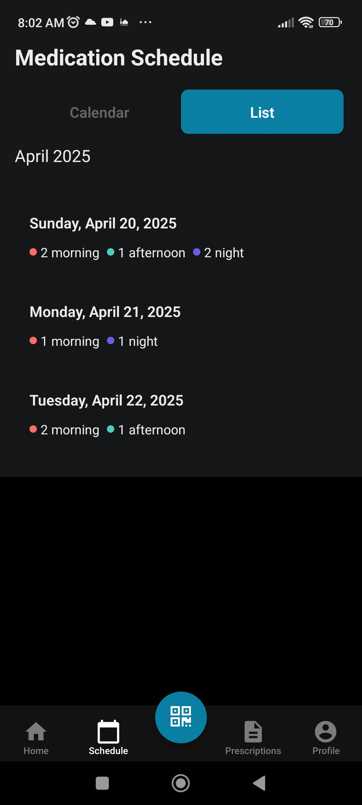
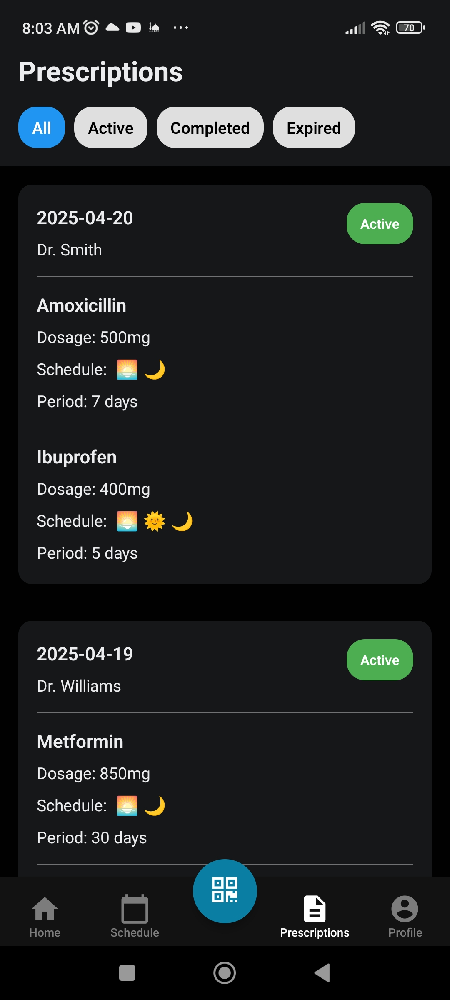
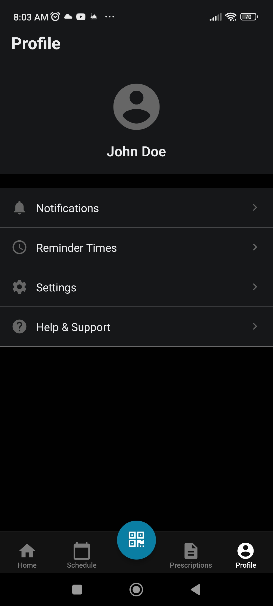
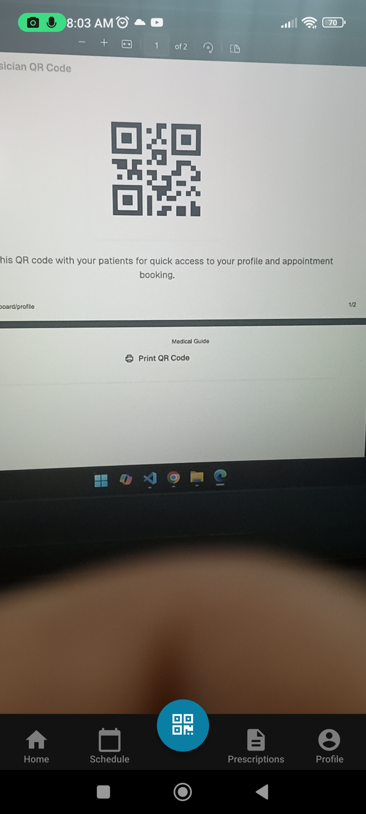

# Medical Guide Mobile App

A comprehensive mobile application for managing medications, prescriptions, and health schedules. Built with React Native and Expo.

## Features

- **Daily Medication Management**
  - View and track daily medications organized by time of day (morning, afternoon, night)
  - Mark medications as taken
  - Visual indicators for medication status
  - Health alerts for important notifications

- **Medication Calendar**
  - Monthly calendar view with medication schedules
  - List view for detailed daily medication times
  - Visual indicators for morning, afternoon, and night medications
  - Easy toggle between calendar and list views

- **Prescription Management**
  - View all prescriptions with detailed information
  - Filter prescriptions by status (active, completed, expired)
  - Track medication dosage and schedule
  - Doctor information and prescription dates

- **QR Code Scanner**
  - Scan doctor's QR codes to share patient profile information
  - Secure medical data sharing between healthcare providers
  - Quick access to patient health records

- **Profile Management**
  - Personal profile settings
  - Notification preferences
  - Reminder time settings
  - Help and support access

## Technologies Used

- React Native
- Expo
- TypeScript
- React Navigation
- Expo Router
- Expo Camera (for QR scanning)
- React Native Reanimated (for animations)

## Prerequisites

Before you begin, ensure you have installed:
- Node.js (LTS version)
- npm or yarn
- Expo CLI (`npm install -g expo-cli`)
- iOS Simulator (for Mac users) or Android Studio (for Android development)

## Getting Started

1. Clone the repository:
   ```bash
   git clone [repository-url]
   cd medical-guide-mobile
   ```

2. Install dependencies:
   ```bash
   npm install
   ```

3. Start the development server:
   ```bash
   npx expo start
   ```

4. Run on your preferred platform:
   - Press `i` for iOS simulator
   - Press `a` for Android emulator
   - Scan the QR code with Expo Go app on your device

## Development

### Project Structure
```
medical-guide-mobile/
├── app/                    # Main application screens
│   ├── (tabs)/            # Tab-based navigation screens
│   └── _layout.tsx        # Root layout configuration
├── components/            # Reusable components
├── constants/            # App constants and theme
├── hooks/               # Custom React hooks
└── assets/             # Images and fonts
```

### Available Scripts

- `npm start` - Start the Expo development server
- `npm run android` - Run on Android emulator
- `npm run ios` - Run on iOS simulator
- `npm run web` - Run in web browser
- `npm test` - Run tests
- `npm run lint` - Run linting

## Features in Detail

### Home Screen
- Daily medication overview
- Health alerts
- Current date display
- Medication cards by time of day



### Calendar Screen
- Monthly calendar view
- List view option
- Color-coded medication indicators
- Schedule type legend




### Prescriptions Screen
- Status-based filtering
- Detailed medication information
- Visual schedule indicators
- Doctor information



### Profile Screen
- User information
- Settings management
- Notification preferences
- Support access



### QR Code Scanner
- Scan QR codes to share patient profile
- Secure data sharing
- Quick access to records



## Contributing

1. Fork the repository
2. Create your feature branch (`git checkout -b feature/AmazingFeature`)
3. Commit your changes (`git commit -m 'Add some AmazingFeature'`)
4. Push to the branch (`git push origin feature/AmazingFeature`)
5. Open a Pull Request

## License

This project is licensed under the MIT License - see the LICENSE file for details.

## Acknowledgments

- Built with Expo
- Uses React Native components
- Material Icons and custom themed components
